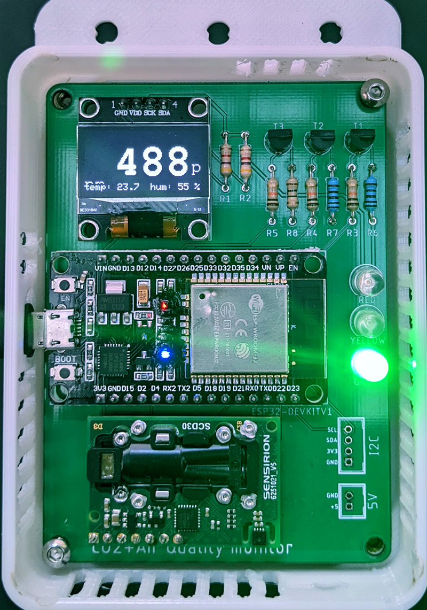
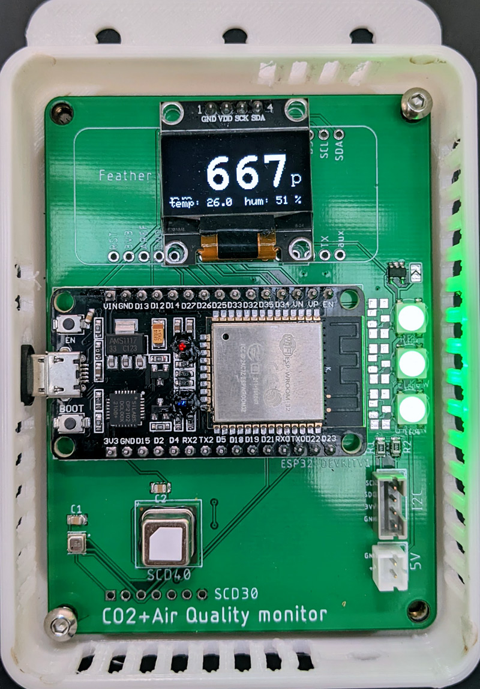
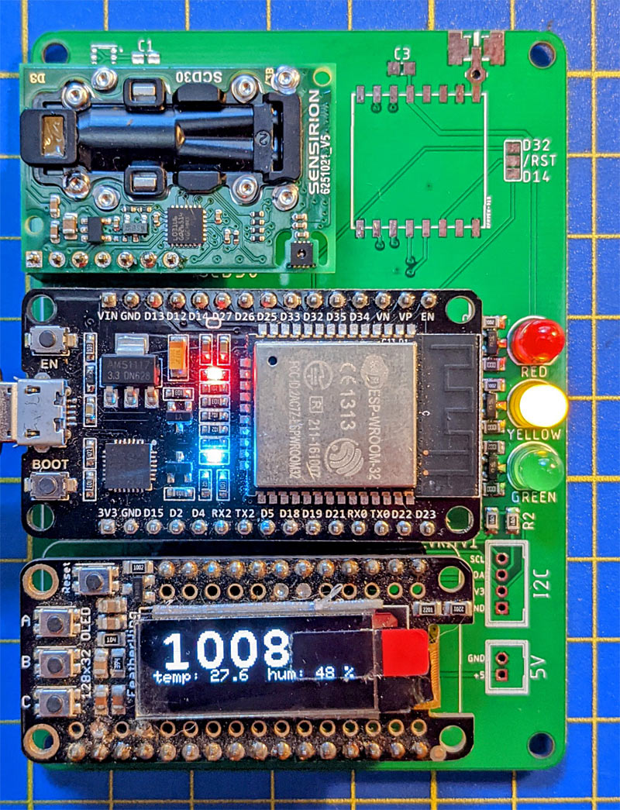
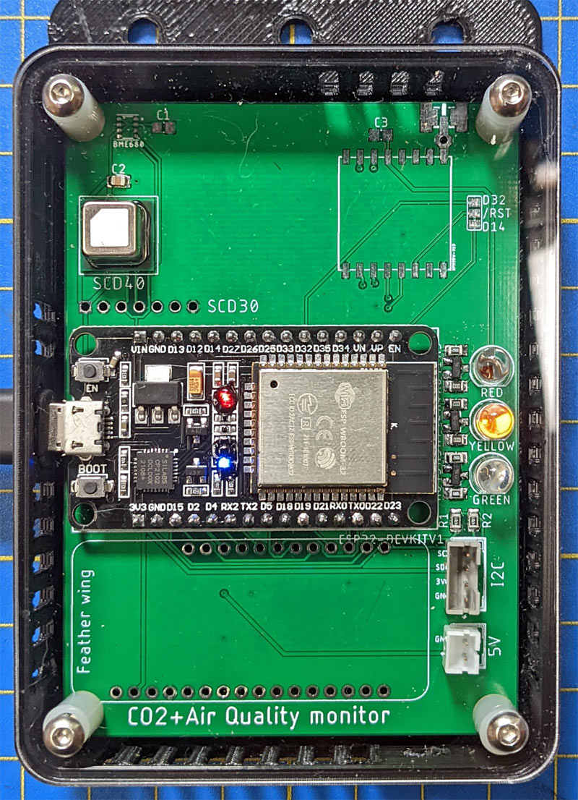
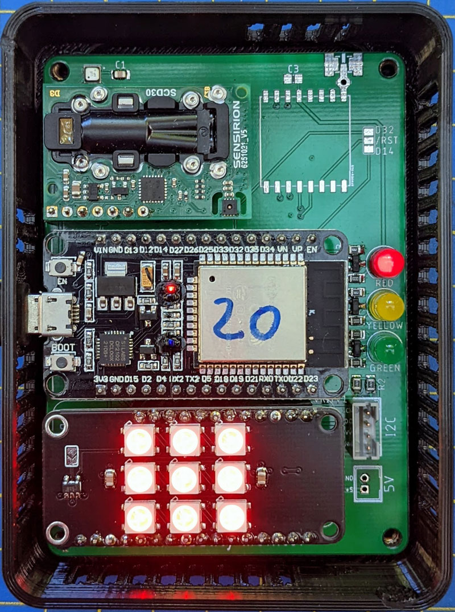
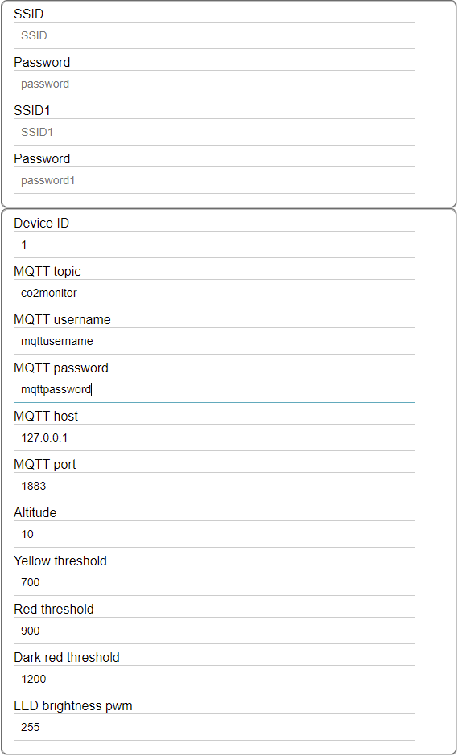

# CO2 and Air Quality Monitor

**ESP32 DevKit (30pin) or Feather based**

Inspired by and many thanks to
[make-IoT / CO2-Ampel](https://github.com/make-IoT/CO2-Ampel) and [Umwelt-Campus](https://www.umwelt-campus.de/en/forschung/projekte/iot-werkstatt/translate-to-englisch-ideen-zur-corona-krise)

# Why use a CO2 Monitor?

A large risk of Covid-19 transmission stems from airborne virus particles that can linger in poorly ventilated spaces for hours. This has been recognised by the WHO. To lower the risk of infection, particularly in busier indoor settings, good ventilation and regular air exchange are key.

This is where measuring CO2 levels in rooms can provide a direct and good indication of sufficient ventilation which correlates with reduced viral load and low risk of virus transmission. Good air quality is also important for creating a good learning or work environment.

Poorly ventilated rooms often feel stale and ‘stuffy’, but by the time we can feel that the air quality is already pretty poor; early indications are easily missed. A sensitive and consistent CO2 monitor can accurately measure CO2 levels and display an easy-to-understand and actionable traffic light indication with orange as an indication of worsening air quality and red as a reminder to open a window.

The data collected by the sensors should be logged and made available for further consumption. It can be visualised on a central school/organisation-wide dashboard and used to establish a baseline and understand patterns or identify rooms that are more difficult to ventilate, as well as providing potential alerting or to remotely checking a room before another group uses it.

These CO2 monitors have been tested in collaboration with researchers from the public health department of the University of Otago.

## Resources

- [RNZ interview](https://www.rnz.co.nz/national/programmes/afternoons/audio/2018840570/handyman-dad-builds-units-to-monitor-class-air-quality)
- [The What, How and Why of CO2 Monitoring](https://makezine.com/2021/05/17/the-what-how-and-why-of-co-monitoring/)
- [Ventilation in NZ schools during the Omicron wave – results from a preliminary study](https://blogs.otago.ac.nz/pubhealthexpert/ventilation-in-nz-schools-during-the-omicron-wave-results-from-a-preliminary-study/)
- [Ministry of Education Indoor Air Quality and Thermal Comfort](https://assets.education.govt.nz/public/Documents/Primary-Secondary/Property/Design/Indoor-Air-Quality-and-Thermal-Comfort-V2-v2.0-2022.pdf)
- [What size particle is important to transmission of COVID-19?](https://www.aerosol.mech.ubc.ca/what-size-particle-is-important-to-transmission/)
- [Comparison of Low-Cost Particulate Matter Sensors for Indoor Air Monitoring during COVID-19 Lockdown](https://www.ncbi.nlm.nih.gov/pmc/articles/PMC7766947/pdf/sensors-20-07290.pdf)

# Sections

- [PCBs](#pcbs) listing the different PCB designs, [parts list](pcb/CO2%20Monitor%20V0.5%20through-hole/bom.md) and [assembly guide](pcb/CO2%20Monitor%20V0.5%20through-hole/step-by-step.md)
- [Firmware](#firmware) describing the device's software features and how to use them
- [Sensors](#sensors) has more information on the available sensors
- [Calibration](#calibration) has some important information on keeping the readings accurate
- [Hardware](#hardware) has a little more background on the controller and wiring

# PCBs

There are now 2 new PCB designs, one for SMD components and another one solely using easy to solder through-hole components.

## Through hole version

[BOM](pcb/CO2%20Monitor%20V0.5%20through-hole/bom.md)

[Assembly guide](pcb/CO2%20Monitor%20V0.5%20through-hole/step-by-step.md)

- uses only through hole components and can be hand soldered
- ESP 32 Devkit (30 pin)
- SCD30 NDIR CO2 sensor
- optional 128x64 0.96 inch OLED display
- 3 x 5mm red/yellow/green LEDs
- optional I2C JST-PH connector for additional connectivity (e.g. SPS30 particulate matter sensor)
- optional USB-B connector to power the monitor



## SMD version

- ESP 32 Devkit (30 pin)
- SCD40 or SCD30 NDIR CO2 sensor
- optional BME680 IAQ/VOC sensor
- optional 128x64 0.96 inch OLED display
- alternatively Feather wing footprint for easy expansion modules
- combined footprints for either 3 Neopixels (WS2812B 5050) or 3 x 5mm red/yellow/green LEDs
- I2C JST-PH connector for additional connectivity (e.g. SPS30 particulate matter sensor)
- optional USB-B connector to power the monitor



## First generation

- ESP 32 Devkit (30 pin)
- SCD40 or SCD30 NDIR CO2 sensor
- optional BME680 IAQ/VOC sensor
- Feather wing footprint for easy expansion modules
- 3 x 5mm red/yellow/green LEDs
- I2C JST-PH connector for additional connectivity (e.g. SPS30 particulate matter sensor)
- RFM96 LoRa modem and u.Fl/SMA footprint





## First generation with Neopixel feather wing



# Firmware

[](https://github.com/oseiler2/CO2Monitor/actions/workflows/pre-release.yml)
[](https://github.com/oseiler2/CO2Monitor/actions/workflows/tagged-release.yml)

## Wifi

Supports [ESPAsync WiFiManager](https://github.com/khoih-prog/ESPAsync_WiFiManager) to set up wireless credentials and further configuration.

### Up to v1.2.3

If no wifi credentials have been configured yet it will automatically launch an AP using the SSID `CO2-Monitor-<ESP32mac>`.

Once wifi credentials have been configured briefly pressing the `Boot` button on the ESP32 puts the device in configuration mode:

### From v1.2.4

Pressing the `Boot` button for less than 2 seconds launches an AP using the SSID `CO2-Monitor-<ESP32mac>`. Connecting to this AP allows the Wifi credentials for the monitor to be set.

A password for the AP can be configured in the file `extra.ini` which needs to be created by copying [extra.template.ini](extra.template.ini) and applying the desired changes.



## Configuration

The monitor is configured via the `config.json` file on the ESP32 file system. There are 3 ways the configuration can be changed:

- via the web interface
- by directly editing [config.json](data/config.json) and uploading it via `Upload Filesystem Image`
- via MQTT (once connected)

## Backend using Mosquitto - Node-Red - InfluxDB - Grafana

[Docker compose file](./docker/docker.md) to set up the database and dashboards.

## MQTT

Sensor readings can be published via MQTT for centralised storage and visualition. Each node is configured with its own id and will then publish under `co2monitor/<id>/up/sensors`. The top level topic `co2monitor` is configurable. Downlink messages to nodes can be sent to each individual node using the id in the topic `co2monitor/<id>/down/<command>`, or to all nodes when omitting the id part `co2monitor/down/<command>`

SCD3x/SCD4x

```
{
  "co2": 752,
  "temperature": "21.6",
  "humidity": "52.1"
}
```

BME680

```
{
  "iaq": 19,
  "temperature": "19.2",
  "humidity": "75.6",
  "pressure": 1014
}
```

SPS30

```
{
  "pm0.5": 16,
  "pm1": 19,
  "pm2.5": 19,
  "pm4": 19,
  "pm10": 19
}
```

Sending `co2monitor/<id>/down/getConfig` will triger the node to reply with its current settings under `co2monitor/<id>/up/config`

```
{
  "appVersion": 1,
  "altitude": 10,
  "co2GreenThreshold": 0,
  "co2YellowThreshold": 700,
  "co2RedThreshold": 900,
  "co2DarkRedThreshold": 1200,
  "iaqGreenThreshold": 0,
  "iaqYellowThreshold": 100,
  "iaqRedThreshold": 200,
  "iaqDarkRedThreshold": 300,
  "brightness": 255,
  "mac": "xxyyzz",
  "ip": "1.2.3.4",
  "scd40": true,
  "scd30": true,
  "bme680": true,
  "lcd": true,
  "sps30": true,
  "sps30AutoCleanInt": 604800,
  "sps30Status": 0,
  "tempOffset": "7.0",
  "ssd1306Rows": 64,
  "greenLed": 27,
  "yellowLed": 26,
  "redLed": 25,
  "neopixelData": 16,
  "neopixelNumber": 3,
  "neopixelMatrixData": 14,
  "featherMatrixData": 27,
  "featherMatrixClock": 13,
  "matrixRows": 5,
  "matrixColumns": 12,
  "matrixLayout": 0,
  "hub75R1": 15,
  "hub75G1": 2,
  "hub75B1": 4,
  "hub75R2": 16,
  "hub75G2": 12,
  "hub75B2": 17,
  "hub75ChA": 5,
  "hub75ChB": 18,
  "hub75ChC": 19,
  "hub75ChD": 14,
  "hub75Clk": 27,
  "hub75Lat": 26,
  "hub75Oe": 25
}
```

A message to `co2monitor/<id>/down/setConfig` will set the node's configuration to the provided parameters. Note that changes to the hardware configuration will trigger a reboot.

```
{
  "altitude": 10,
  "co2GreenThreshold": 0,
  "co2YellowThreshold": 700,
  "co2RedThreshold": 900,
  "co2DarkRedThreshold": 1200,
  "iaqGreenThreshold": 0,
  "iaqYellowThreshold": 100,
  "iaqRedThreshold": 200,
  "iaqDarkRedThreshold": 300,
  "brightness": 255,
  "ssd1306Rows": 64,
  "greenLed": 27,
  "yellowLed": 26,
  "redLed": 25,
  "neopixelData": 16,
  "neopixelNumber": 3,
  "featherMatrixData": 27,
  "featherMatrixClock": 13,
  "hub75R1": 15,
  "hub75G1": 2,
  "hub75B1": 4,
  "hub75R2": 16,
  "hub75G2": 12,
  "hub75B2": 17,
  "hub75ChA": 5,
  "hub75ChB": 18,
  "hub75ChC": 19,
  "hub75ChD": 14,
  "hub75Clk": 27,
  "hub75Lat": 26,
  "hub75Oe": 25
}
```

A message to `co2monitor/<id>/down/setTemperatureOffset` will set the SCD3x/SCD4x's temperature offset (float, °C):

```
7.0
```

A message to `co2monitor/<id>/down/calibrate` will manually calibrate the SCD3x/SCD4x sensor to the given value:

```
412
```

A message to `co2monitor/<id>/down/setSPS30AutoCleanInterval` will set the SPS30 fan auto-clean interval in seconds to the given value:

```
604800
```

A message to `co2monitor/<id>/down/cleanSPS30` will run a fan clean on the SPS30.

A message to `co2monitor/<id>/down/installMqttRootCa` will attempt to install the pem-based ca cert in the payload as root cert for tls enabled MQTT connections. A connection attempt will be made using the configured MQTT settings and the new cert, and if successful the cert will be persisted, otherwise discarded.

A message to `co2monitor/<id>/down/installRootCa` will install the pem-based ca cert in the payload as root cert for OTA update requests.

A message to `co2monitor/<id>/down/ota` will trigger the OTA polling mechnism if configured.

A message to `co2monitor/<id>/down/forceota` will force an OTA update using the URL provided in the payload.

A message to `co2monitor/<id>/down/reboot` will trigger a reset on the node.

A message to `co2monitor/<id>/down/resetWifi` will wipe configured WiFi settings (SSID/password) and force a reboot.

### MQTT TLS support

To connect to an MQTT server using TLS (recommended) you need to enable TLS in the configuration by setting `mqttUseTls` to `true`. You also need to supply a root CA certificate in PEM format on the file system as `/mqtt_root_ca.pem` and/or a client certificate and key for using mTLS as `mqtt_client_cert.pem` and `mqtt_client_key.pem`. These files can be uploaded using the `Upload Filesystem Image` project task in PlatformIO. Alternatively you can set `mqttInsecure` to `true` to disable certificate validation altogether.

## Supported sensors

- [SCD3x NDIR CO2, temperature and humidity sensor](https://www.sensirion.com/en/environmental-sensors/carbon-dioxide-sensors/carbon-dioxide-sensors-scd30/)
- [SCD4x NDIR CO2, temperature and humidity sensor](https://www.sensirion.com/en/environmental-sensors/carbon-dioxide-sensors/carbon-dioxide-sensor-scd4x/)
- [BME680 IAQ, VOC, temperature and humidity sensor](https://www.bosch-sensortec.com/products/environmental-sensors/gas-sensors/bme680/)
- [SPS30 Small Particulate matter sensor](https://sensirion.com/products/catalog/SPS30/)

## Supported displays

- [128x32 OLED feather wing](https://www.adafruit.com/product/2900)
- [SSD1306 based displays](https://www.aliexpress.com/wholesale?SearchText=128X64+SSD1306)
- [Dot Star feather wing](https://www.adafruit.com/product/3449)
- [Neopixel feather wing](https://www.adafruit.com/product/2945)
- Neopixel strips
- Neopixel matrix feather wing
- [HUB75 based RBG Matrix panels](https://www.adafruit.com/?q=RGB+LED+Matrix+Panel&sort=BestMatch)

# Sensors

The presence of supported I2C based sensors/displays will be automatically detected on start-up.

## SCD3x

A SCD3x NDIR CO2 sensor can be connected to the designated footprint and will provide CO2, temperature and humidity readings via I2C. It supports a separate ready signal which is connected to the ESP32.

## SCD4x

A SCD4x NDIR CO2 sensor can be soldered directly onto the pcb and provides CO2, temperature and humidity readings via I2C.

## BME680

A BME680 sensor can be directly soldered onto the dedicates footprint or connected via the I2C JST header [Adafruit BME680](https://www.adafruit.com/product/3660), [STEMMA to JST SH Cable](https://www.adafruit.com/product/4424) to provide additional VOC and AIQ measurements.

## SPS30 Particulate matter sensor

The SPS30 sensor can be connected to the I2C and 5V JST connectors of the pcb.

| fn  | I2C | 5V  | SPS30 |
| --- | --- | --- | ----- |
| VDD |     | +5V | 1     |
| SDA | SDA |     | 2     |
| SCL | SCL |     | 3     |
| SEL | GND |     | 4     |
| GND |     | GND | 5     |

## other

Other I2C based sensors can be wired using the JST-PH I2C header.

# Calibration

CO2 sensors need to be regularly calibrated to provide reliable measurements. The used sensors support auto-calibration and that is enabled in the firmware. It works by looking over measurements over a period and calibrating the lowest value against 420ppm (configurable in the firmware). This is based on the assumption that the monitor 'sees' clean outside air about once a week. If that cannot be achieved the firmware also allows for a forced calibration against a given value. Please also make sure to set the altitude setting according to the monitor location. For details please check the sensor's datasheets.

## From v1.2.4

Manual calibration can be triggered by pressing the `Boot` button for more than 5 seconds. Make sure the monitor has been exposed to fresh outside air for a while and be careful not to breathe towards the monitor when doing this.

# Hardware

The board was designed to use an ESP32 or a Feather controller

## ESP32

When an ESP32 is used the feather footprint can be used to drive feather wings. Since some pins are shared with other components please check carefully before connecting a feather.

## Feather

A feather controller can be used to drive the sensors and LEDs, but unfortunately not the RFM96.

## Pin mapping

| ESP32 Devkit (30 pin) | fn       | Feather pin | fn    | LEDs   | SCD3x/4x/BME680/SPS30 | Neopixel |
| --------------------- | -------- | ----------- | ----- | ------ | --------------------- | -------- |
| 1                     | EN       |             |       |        |                       |          |
| 2                     | VP-D36   | 9           | A4    |        |                       |          |
| 3                     | VN-D39   | 8           | A3    |        |                       |          |
| 4                     | D34      | 7           | A2    |        |                       |          |
| 5                     | D35      |             |       |        | RDY (SCD3x)           |          |
| 6                     | D32      | 20          | D6    |        |                       |          |
| 7                     | D33      | 22          | D10   |        |                       |          |
| 8                     | D25      | 6           | A1    | Red    |                       |          |
| 9                     | D26      | 5           | A0    | Yellow |                       |          |
| 10                    | D27      | 23          | D11   | Green  |                       |          |
| 11                    | D14      | 19          | D5    |        |                       |          |
| 12                    | D12      | 24          | D12   |        |                       |          |
| 13                    | D13      | 25          | D13   |        |                       |          |
| 14                    | GND      |             |       |        |                       |          |
| 15                    | V_in     | 26          | V_USB |        |                       |          |
| 16                    | 3V3      | 2           | 3V3   |        |                       |          |
| 17                    | GND      | 4           | GND   |        |                       |          |
| 18                    | D15      | 21          | D9    |        |                       |          |
| 19                    | D2       |             |       |        |                       |          |
| 20                    | D4       | 10          | A5    |        |                       |          |
| 21                    | D16      |             |       |        |                       | DIN      |
| 22                    | D17      |             |       |        |                       |          |
| 23                    | D5/CS0   |             |       |        |                       |          |
| 24                    | D18/SCK  | 11          | SCK   |        |                       |          |
| 25                    | D19/MISO | 13          | MISO  |        |                       |          |
| 26                    | D21/SDA  | 17          | SDA   |        | SDA                   |          |
| 27                    | D3/Rx    | 14          | Rx    |        |                       |          |
| 28                    | D1/TxD   | 15          | Tx    |        |                       |          |
| 29                    | D22/SCL  | 18          | SCL   |        | SCL                   |          |
| 30                    | D23/MOSI | 12          | MOSI  |        |                       |          |
|                       |          | 1           | RST   |        |                       |
|                       |          | 3           | AREF  |        |                       |
|                       |          | 16          | aux   |        |                       |
|                       |          | 27          | En    |        |                       |
|                       |          | 28          | VBat  |        |                       |

## LEDs

The board has room for 3 x 5mm LEDs for traffic light style indication. Each is driven by a transistor to relieve the ESP32/Feather GPIO pins. High intensity LEDs allow for good visibility, but can also be dimmed using the ESP32 internal PWM channels if needed.

- [Green, 12.5cd, 30°, 20 mA, 3.2 V](https://nz.element14.com/cree/lc503fpg1-30q-a3-00001/led-5mm-green/dp/1648988) (use 5Ω resistor)
- [Yellow, 9.3cd, 30°, 20 mA, 2.1 V](https://nz.element14.com/broadcom-limited/hlmp-el3g-vx0dd/led-amber-9-3cd-590nm-th/dp/2900814) (use 60Ω resistor)
- [Red, 9.3cd, 30°, 20 mA, 2.1 V](https://nz.element14.com/broadcom-limited/hlmp-eg3a-wx0dd/led-5mm-alingap-red-30deg/dp/1706677) (use 60Ω resistor)

Set the `greenLed`, `yellowLed` and `redLed` configuration properties to valid pin numbers (`27`, `26`, `25`).

## Neopixel

Set the `neopixelData` and `neopixelNumber` configuration properties to the neopixel pin number (`16`) and the number of neopixels (`3`).

## Neopixel matrix

Set the `neopixelMatrixData`, `matrixColumns`, `matrixRows` and `matrixLayout` configuration properties to the neopixel matrix data pin number (`14`), number of columns (`12`) and rows (`5`), and the matrix layout (`0`).

## Feather wings

### [6 x 12 DotStar](https://www.adafruit.com/product/3449)

Set the `featherMatrixData` and `featherMatrixClock` configuration properties to the feathermatrix data (`27`) and clk (`13`) pin numbers.

### [128x32 OLED](https://www.adafruit.com/product/2900)

Set the `ssd1306Rows` configuration to `32`

### [128x64 OLED](https://www.aliexpress.com/wholesale?SearchText=128X64+SSD1306)

Set the `ssd1306Rows` configuration to `64` (default setting)

### [64x32 RBG Matrix panel](https://www.adafruit.com/?q=64x32+RGB+LED+Matrix&sort=BestMatch)

Set the `hub75*` configuration properties to the correct pin numbers.

## RFM96 (first generation)

This allows adding a LoRa modem when no WiFi is available to transmit measurements.
