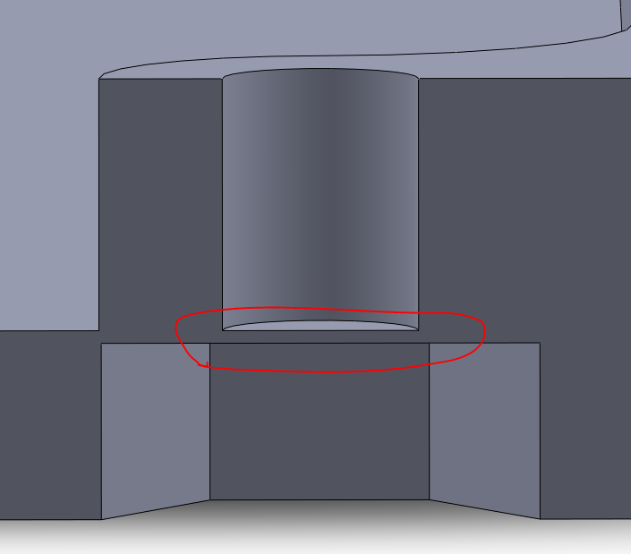

# Cases

The case consists of a 3d printed body and a laser cut transparent acrylic front panel secured with 4 M3 button head screws and hex nuts. The PCB is secured be the screws and 3.2mm Nylon standoffs between the PCB and front panel.

## 3d printed case

There are 3 versions of the main case available, with either 10mm or 15mm clearance over the PCB.
The 15mm version is recommended for a little more room inside.

| file                      | description             | power cutout | standoff length | screw length |
| ------------------------- | ----------------------- | ------------ | --------------- | ------------ |
| Case v0.4_10mm_cable.STL  | flat case               | cable        | 10mm            | 20mm         |
| Case v0.4_15mm_cable.STL  | normal case             | cable        | 15mm            | 25mm         |
| Case v0.4_15mm_USB.STL    | normal case             | USB-B        | 15mm            | 25mm         |
| Case v0.4_10mmSPS30_cable | includes room for SPS30 | cable        | 10mm            | 25mm         |
| Case v0.4_15mmSPS30_USB   | includes room for SPS30 | USB-C        | 15mm            | 30mm         |
| SCD40 breakout            | SCD40/BME680 breakout   |              | 15mm            | 25mm         |

The body should be printed in the following orientation

The screw holes have thin discs included in the model in order to avoid having to print support material. Once printed it can ne opened up with a 3mm drill.

## Front panel

The front panel is best laser cut from 2mm transparent acrylic. Most places should be able to use the `Panel.eps` file but it might help to include the `Panel dimensions.PNG` file as well.

## SCD40 break out

This case is used for the RBG matrix verion of the CO2 Monitor to house the smaller PCB with the SCD40 and BME680 sensors.
