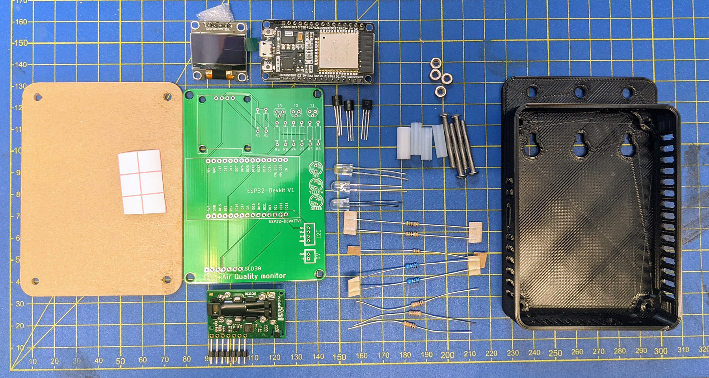

# List of required parts for the v0.5 through hole version

[Assembly guide](./step-by-step.md)

| Component      | Description                   | Part #                                                                                                            | Amount       | Indicative cost (NZD ex GST) | Supplier                                                                                                  | Alternative supplier                                                                                       |
| -------------- | ----------------------------- | ----------------------------------------------------------------------------------------------------------------- | ------------ | ---------------------------- | --------------------------------------------------------------------------------------------------------- | ---------------------------------------------------------------------------------------------------------- |
| PCB            |                               |                                                                                                                   | 1            | $2.00                        | [JLCPCB](https://cart.jlcpcb.com/quote)                                                                   | [Seeed](https://www.seeedstudio.com/fusion_pcb.html)                                                       |
| U1             | ESP32 DevKitV1 (30 pin)       | ESP-32 30PIN                                                                                                      | 1            | $5.00                        | [AliExpress](https://www.aliexpress.com/item/32864722159.html)                                            |                                                                                                            |
| U2             | SCD30 CO2 NDIR sensor         |                                                                                                                   | 1            | $50-116                      | [DigiKey](https://www.digikey.co.nz/en/products/detail/sensirion-ag/SCD30/8445334)                        | [AliExpress](https://www.aliexpress.com/item/1005002467019989.html)                                        |
|                | pin header (SIL 7)            |                                                                                                                   | 1            | $0.67                        | [DigiKey](https://www.digikey.co.nz/en/products/detail/harwin-inc/M20-9770846/3727783)                    | [Element14](https://nz.element14.com/harwin/m20-9770846/conn-header-8pos-1row-2-54mm/dp/3756340)           |
| U3             | SSD1306 OLED display          | 0.96 inch OLED IIC Display Module 128X64 SSD1306                                                                  | 1 (optional) | $2.50                        | [AliExpress](https://www.aliexpress.com/item/32896971385.html)                                            |                                                                                                            |
| D1             | red LED                       | HLMP-EG3A-WX0DD                                                                                                   | 1            | $1.65                        | [DigiKey](https://www.digikey.co.nz/en/products/detail/broadcom-limited/HLMP-EG3A-WX0DD/3909242)          | [Element14](https://nz.element14.com/cree/lc503fpg1-30q-a3-00001/led-5mm-green/dp/1648988)                 |
| D2             | yellow LED                    | HLMP-EL3G-VX0DD                                                                                                   | 1            | $1.47                        | [DigiKey](https://www.digikey.co.nz/en/products/detail/broadcom-limited/HLMP-EL3G-VX0DD/10511912)         | [Element14](https://nz.element14.com/broadcom-limited/hlmp-el3g-vx0dd/led-amber-9-3cd-590nm-th/dp/2900814) |
| D3             | green LED                     | LC503FPG1-30Q-A3-00001                                                                                            | 1            | $0.40                        | [DigiKey](https://www.digikey.co.nz/en/products/detail/creeled-inc/C503B-GCN-CY0C0791/1922940)            | [Element14](https://nz.element14.com/cree/lc503fpg1-30q-a3-00001/led-5mm-green/dp/1648988)                 |
| R1,R2          | 4.7 kOhm resistor             |                                                                                                                   | 2            | $0.17                        | [DigiKey](https://www.digikey.co.nz/en/products/detail/stackpole-electronics-inc/CF14JT4K70/1741428)      |                                                                                                            |
| R3, R4, R5     | 10 kOhm resistor              |                                                                                                                   | 3            | $0.17                        | [DigiKey](https://www.digikey.co.nz/en/products/detail/stackpole-electronics-inc/CF14JT10K0/1741265)      |                                                                                                            |
| R6, R7         | 51 Ohm resistor               |                                                                                                                   | 2            | $0.17                        | [DigiKey](https://www.digikey.co.nz/en/products/detail/koa-speer-electronics-inc/CF1-4CT52R510J/13537362) |                                                                                                            |
| R8             | 5.1 Ohm resistor              |                                                                                                                   | 1            | $0.17                        | [DigiKey](https://www.digikey.co.nz/en/products/detail/stackpole-electronics-inc/CFM14JT5R10/1742230)     |                                                                                                            |
| Q1, Q2, Q3     | BC547 NPN transistor          |                                                                                                                   | 3            | $0.61                        | [DigiKey](https://www.digikey.co.nz/en/products/detail/onsemi/BC547CTFR/976374)                           |                                                                                                            |
| J1             | JST-PH2 power connector       | B2B-PH-K-S                                                                                                        | 1 (optional) |                              | [DigiKey](https://www.digikey.co.nz/en/products/detail/jst-sales-america-inc/B2B-PH-K-S-LF-SN/926611)     |                                                                                                            |
| J2             | JST-PH4 I2C connector         | B4B-PH-K-S                                                                                                        | 1 (optional) |                              | [DigiKey](https://www.digikey.co.nz/en/products/detail/jst-sales-america-inc/B4B-PH-K-S-LF-SN/926613)     |                                                                                                            |
| J3             | USB power input               | USB-B1HSW6                                                                                                        | 1 (optional) | $1.05                        | [DigiKey](https://www.digikey.co.nz/en/products/detail/on-shore-technology-inc/USB-B1HSW6/2677743)        |                                                                                                            |
| case           | 3d printed                    |                                                                                                                   | 1            | $2.00                        |                                                                                                           |                                                                                                            |
| front panel    | laser cut 2mm acrylic         | provide these files: [Panel.eps](../../case/Panel.eps), [Panel dimensions.PNG](../../case/Panel%20dimensions.PNG) | 1            | $2-10                        | [Graley Plastics](https://www.graleyplastics.co.nz)                                                       |                                                                                                            |
| M3 screw       | M3 x 25mm                     |                                                                                                                   | 4            |                              |                                                                                                           |                                                                                                            |
| M3 hex nut     | M3                            |                                                                                                                   | 4            |                              |                                                                                                           |                                                                                                            |
| 15mm stand off | 3.2mm ID, 5mm OD, 15mm length |                                                                                                                   | 4            | $0.32                        | [DigiKey](https://www.digikey.co.nz/en/products/detail/essentra-components/13ME024/11638316)              | [Element14](https://nz.element14.com/duratool/d01479/pcb-round-spacer-nylon66-natural/dp/1733409)          |
| Power Supply   | old USB-A phone charger       |                                                                                                                   | 1            |                              |                                                                                                           |                                                                                                            |
| USB cable      | micro USB or USB-B            |                                                                                                                   | 1            |                              |                                                                                                           |                                                                                                            |
| diffusor film  | 2x3 cm                        | e.g. window film to diffuse the lights and make them less direct                                                  | 1            |                              | Hardware store (can be bought by the metre)                                                               |                                                                                                            |

